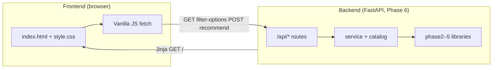
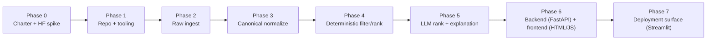
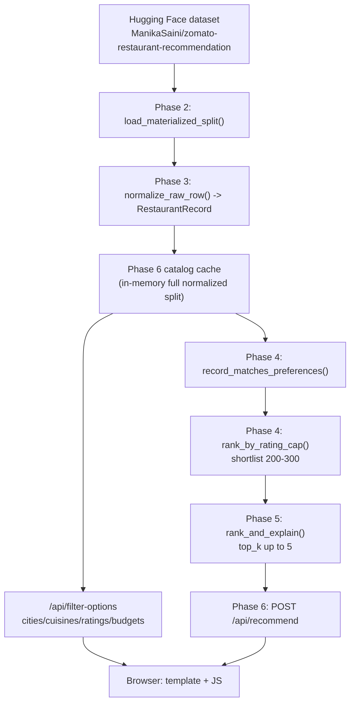

# Phase-wise architecture (Final, completed Phases 0–7)

Companion to [ProblemStatement.md](./ProblemStatement.md).  
This file now reflects the **implemented system**, not a forward roadmap.  
For boundary handling and negative paths, see [EdgeCases.md](./EdgeCases.md).

## Backend and frontend (Phase 6 product)

The shipped product is a **single Python process**: a **FastAPI backend** that serves both **JSON APIs** and the **browser UI** (no separate Node/React build). Phase 1’s optional preview on port 8000 is a different, smaller app; the **main** backend+frontend pair lives in **Phase 6**.

### Backend (server)

| Layer | Role | Location (repo) |
| --- | --- | --- |
| **HTTP / routing** | FastAPI app, CORS not required for same-origin UI | [`phase6/src/zomato_surface/app.py`](../phase6/src/zomato_surface/app.py) |
| **Recommendation orchestration** | Preferences → filter → shortlist → LLM | [`phase6/src/zomato_surface/service.py`](../phase6/src/zomato_surface/service.py) |
| **Data catalog** | One-time HF materialize + normalize; in-memory cache | [`phase6/src/zomato_surface/catalog.py`](../phase6/src/zomato_surface/catalog.py) |
| **Filter options API** | Distinct cities/cuisines/ratings/budgets from catalog | [`phase6/src/zomato_surface/filter_options.py`](../phase6/src/zomato_surface/filter_options.py) |
| **Request validation** | Pydantic bodies (e.g. `RecommendRequest`) | [`phase6/src/zomato_surface/api_schemas.py`](../phase6/src/zomato_surface/api_schemas.py) |
| **Domain libraries** | Ingest, normalize, filter, LLM (imported, not HTTP) | [`phase2/`](../phase2/README.md) → [`phase5/`](../phase5/README.md) |

**Backend endpoints (summary):**

| Method | Path | Purpose |
| --- | --- | --- |
| GET | `/` | Serves main HTML (Jinja template) |
| GET | `/static/*` | CSS and future static assets |
| GET | `/api/health` | Liveness |
| GET | `/api/filter-options` | Dropdown data (from catalog) |
| POST | `/api/recommend` | Filter + shortlist + LLM; JSON result |
| GET | `/docs` | OpenAPI (FastAPI) |

### Frontend (browser)

| Layer | Role | Location (repo) |
| --- | --- | --- |
| **Page shell** | HTML structure, form, result list | [`phase6/src/zomato_surface/templates/index.html`](../phase6/src/zomato_surface/templates/index.html) |
| **Styling** | Layout, theme, LLM badge | [`phase6/src/zomato_surface/static/style.css`](../phase6/src/zomato_surface/static/style.css) |
| **Client logic** | `fetch('/api/filter-options')`, `fetch('/api/recommend')`, DOM updates | Embedded `<script>` in `index.html` (vanilla JS, no bundler) |

The canonical frontend is served by the same FastAPI app (Phase 6 template + JS),
so the product runs on a **single URL/port** in normal usage.





## End-to-end runtime architecture (current)



### Request lifecycle (Phase 6)

1. App receives user preferences from UI (`/`) and submits to `POST /api/recommend`.
2. Full dataset is loaded from HF and normalized once (first call), then cached in memory.
3. Phase 4 applies deterministic constraints: city, cuisine token match, minimum rating, budget band.
4. Candidates are sorted by rating and capped to `llm_candidate_cap` (**200–300**).
5. Phase 5 asks LLM to return grounded ranked picks (`top_k`, default **5**, max **5**).
6. If LLM fails or key is missing, fallback ranking/explanations are returned.

## Completed phases (0–7)

## Phase 0 — Charter + dataset spike

**Implemented objective:** validate feasibility, freeze preference fields, and define grounded recommendation behavior.

**Delivered:** [`phase0/`](../phase0/README.md)
- `FieldMapping.md`
- `ADR-0001-runtime-and-llm.md`
- `dataset_spike.py`
- `DatasetSpikeReport.md`

**Outcome used by later phases:** fixed field mapping and normalization policy inputs.

---

## Phase 1 — Repository scaffold and runnable baseline

**Implemented objective:** create installable skeleton and CI-ready baseline.

**Delivered:** [`phase1/`](../phase1/README.md)
- Package `zomato_recommend`
- Health/no-op runnable entrypoint
- Tests and phase CI workflow

**Outcome used by later phases:** repeatable install/run path and repo conventions.

---

## Phase 2 — Raw ingestion from Hugging Face

**Implemented objective:** centralize dataset access (streaming and full-load variants).

**Delivered:** [`phase2/`](../phase2/README.md)
- Package `zomato_raw_ingest`
- `iter_raw_rows(...)` (streaming)
- `load_raw_rows(...)` (bounded)
- `load_materialized_split(...)` (**full split in memory**, non-streaming)

**Outcome used by later phases:** single source for all HF reads; local HF cache reuse across runs.

**Dependency note:** `zomato-raw-ingest` requires **`datasets>=4.4.0`** so environments on **Python 3.14** (e.g. Streamlit Community Cloud) do not hit legacy fingerprint/pickle failures inside `datasets` when loading builders.

---

## Phase 3 — Canonical model and normalization

**Implemented objective:** isolate downstream logic from raw HF schema.

**Delivered:** [`phase3/`](../phase3/README.md)
- Package `zomato_canonical`
- `RestaurantRecord` model
- `normalize_raw_row(...)`
- parsers for rating/cost, budget mapping policy constants

**Outcome used by later phases:** all filtering/ranking/LLM logic consumes canonical records only.

---

## Phase 4 — Deterministic filtering and shortlist ranking

**Implemented objective:** enforce hard constraints before any model call.

**Delivered:** [`phase4/`](../phase4/README.md)
- Package `zomato_filter`
- `UserPreferences`
- `record_matches_preferences(...)`
- `rank_by_rating_cap(...)`

**Outcome used by later phases:** explainable, testable pre-LLM narrowing.

---

## Phase 5 — LLM ranking, schema validation, fallback

**Implemented objective:** convert shortlist into grounded explanations with robust fallback.

**Delivered:** [`phase5/`](../phase5/README.md)
- Package `zomato_llm`
- Prompt construction with candidate IDs and preference context
- JSON parsing/validation
- deterministic fallback on error/missing key

**Outcome used by later phases:** production-safe recommendation text path.

---

## Phase 6 — Product surface (backend + frontend)

**Implemented objective:** ship a single deployable unit: **FastAPI backend** plus **browser UI**.

**Delivered:** [`phase6/`](../phase6/README.md)
- **Backend:** package `zomato_surface` — FastAPI app, `service`, `catalog`, `filter_options`, `api_schemas`
- **HTTP:** `/`, `/static/*`, `/api/health`, `/api/filter-options`, `/api/recommend`, `/docs`
- **Frontend:** Jinja template + static CSS + inline vanilla JS (dropdowns, LLM status badge, text-first results)
- Shared in-memory catalog for filter-options and recommend
- Input constraints: `top_k` 1–5, `llm_candidate_cap` 200–300

**Outcome:** proper **backend/frontend** split in one process: UI consumes JSON APIs; all business logic stays in Python.

---

## Phase 7 — Deployment surface (Streamlit)

**Implemented objective:** add a deployment-friendly UI/runtime target using Streamlit for rapid public hosting.

**Delivered:** [`streamlit_app.py`](../streamlit_app.py) + [`phase7/README.md`](../phase7/README.md)  
- Streamlit app shell for preference input + recommendation rendering (same pipeline as Phase 6: catalog → filter → shortlist → LLM)
- Imports Phase 2–6 source trees via `sys.path` in `streamlit_app.py` (no separate HTTP hop)
- **Streamlit Community Cloud:** root [`requirements.txt`](../requirements.txt) is required so the builder installs **`pydantic`**, **`datasets`**, **`huggingface_hub`**, **`openai`**, and **`streamlit`** (cloud does not install phase `pyproject.toml` extras by default)
- **`datasets>=4.4.0`** in that file (and in [`phase2/pyproject.toml`](../phase2/pyproject.toml)) avoids **Python 3.14** breakage during dataset cache fingerprinting (`pickle` / `dill` path); alternatively set **Python 3.12** under deploy **Advanced settings**
- **Secrets on cloud:** configure `OPENAI_API_KEY`, **`GROQ_API_KEY`**, and optional **`HF_TOKEN`** in the app’s Streamlit secrets UI (local dev still uses `phase6/.env` via `run.ps1 -Surface` or manual export)

**Outcome:** optional no-server-ops deployment path for demos and lightweight production usage.

---

## Current package dependency chain

```text
phase6 (surface)
  -> phase5 (llm)
  -> phase4 (filter)
  -> phase3 (canonical)
  -> phase2 (raw_ingest)
```

## Operational notes

- **Primary run path (single-port mode):** `.\run.ps1 -Surface`
- **Single canonical URL:** `http://127.0.0.1:8765/` (UI + API from same process)
- **Phase 7 (Streamlit):** from repo root, `pip install -r requirements.txt` then `streamlit run streamlit_app.py`; first catalog load pulls the full HF split (same as Phase 6 cold start)
- **Environment loading:** `run.ps1 -Surface` loads `phase5/.env` then **`phase6/.env`** (phase6 overrides)
- **Live LLM (backend → provider):** `OPENAI_API_KEY` and/or **`GROQ_API_KEY`** (see `zomato_llm.config`); when provider limits or key issues occur, the app returns smart local fallback explanations
- **Optional for better HF rate limits:** `HF_TOKEN`
- **Dataset scope note:** current source dataset values for `listed_in(city)` are predominantly Bangalore localities.

## Final phase summary

| Phase | Responsibility | Final artifact |
|---|---|---|
| 0 | Problem/data grounding | Spike reports + mapping + ADR |
| 1 | Project baseline | Installable scaffold + CI |
| 2 | Data acquisition | HF raw ingestion APIs |
| 3 | Data standardization | Canonical model + normalization |
| 4 | Deterministic relevance | Filter + shortlist ranking |
| 5 | Language reasoning | Grounded LLM rank/explain + fallback |
| 6 | Product delivery | **Backend** (FastAPI) + **frontend** (HTML/CSS/JS) + orchestration |
| 7 | Deployment channel | **Streamlit** deployment surface + hosting path |
